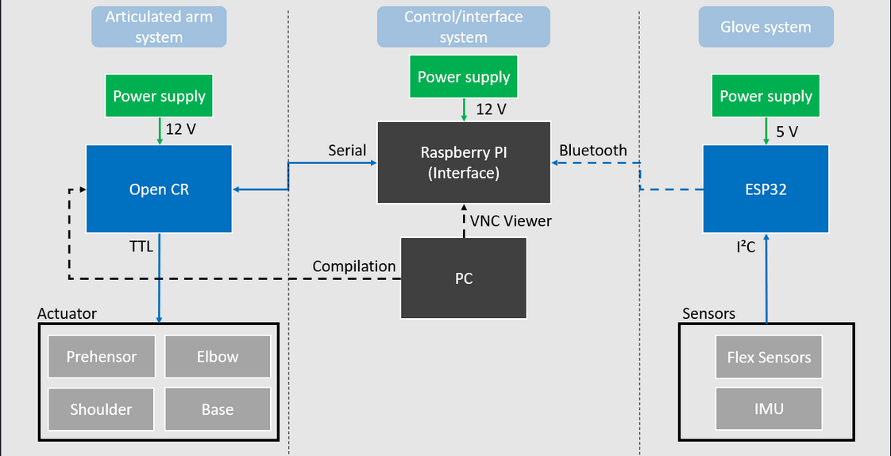
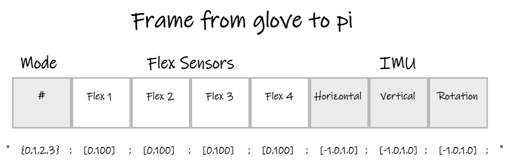

# Sym-Bot : Application (Main Software)

## Table of Content
- [Sym-Bot : Application (Main Software)](#sym-bot--application-main-software)
  - [Table of Content](#table-of-content)
  - [Getting started](#getting-started)
  - [Communication](#communication)
    - [BluetoothComm](#bluetoothcomm)
    - [SerialComm](#serialcomm)
    - [Translate](#translate)
  - [AI](#ai)
  - [Interface](#interface)
  - [Test](#test)
    - [test translate class](#test-translate-class)

## Getting started
First, here's the hardware schematic that you have to keep in mind for every aspect of the project:
<div align="center">
    
</div>

***Setup environment***
- Software : [Visual Studio Code](https://code.visualstudio.com/) (Stable Build) and add extension Python, publisher Microsoft
- Using Python version (3.7 and newer)
- Installing packages from the Python with [command line](https://packaging.python.org/en/latest/tutorials/installing-packages/#installing-from-pypi) :
  - numpy (1.22.2)
  - pyserial (3.5)
  - pybluez (0.23)

Single board computer
* Brand : [RaspBerry Pi](https://www.raspberrypi.com/products/raspberry-pi-4-model-b/)
* Model : Raspberry PI 4 B
* Quantity : 1

## Communication
As you know, the Sym-Bot uses an ESP32, a Raspberry Pi 4 and an OpenCR Arduino microcontroller. All the code found in this section allows the communication between thoses devices to be functional. 
### BluetoothComm
Bluetooth Communication is used between Glove UI (ESP32) and Control System (PI4)

Steps to setup Bluetooth device (Must do before you launch main application) :
1. Turn on Bluetooth on Raspberry PI
2. Supply the device Bluetooth
3. Connect ESP32's device on Raspberry PI
4. Collect the informations device
* If you don't know the MAC & uuid device :
Using [rfcomm-client.py's example](https://github.com/pybluez/pybluez/blob/master/examples/simple/rfcomm-client.py) to find MAC & uuid device
5. Write "BT" to select bluetooth communication in main.py
```
10  # Select Communication's type between "USB" (Alternative proto-board UI) or "BT" (Glove)
11  TypeComm = "BT" 
```
6. Change the MAC & uuid device for yours
```
18      ''' Commmunication Bluetooth '''
19      MAC_ = '58:BF:25:37:A6:9A'                        # your MAC BT device
20      uuid_ = "00001101-0000-1000-8000-00805f9b34fb"    # your uuid BT device
```

### SerialComm
Serial communication is used between Control System (PI4) and Robotic Arm (OpenCr)

Steps to setup Serial device (Must do before you launch main application) :
1. Find the Serial Port of OpenCr Board (You can find this information with Arduino IDE -> Tools -> Ports)
2. Change port number on this line:
```
15  messageIO.addDevice(SerialComm("/dev/ttyACM0", 57600))  # Robotic Arm (OpenCr Board)
```
* On Windows OS, the Port Number starts with COM#
* On Linux OS, the Port Number starts with /dev/ttyACM# or /dev/USB#

### Translate
When the Bluetooth communication is established, it should receive messages in this form:
<div align="center">
    
</div>

As you can see, this message receives the mode, the flexion state of four fingers and information from the IMU. The strucutre used is a dictionary whith the keys "Mode", "Flex" and "IMU".
- Modes are linked with the "chooseMode()" function. It is possible to add others modes if you want, but make sure to use numbers that are used in this function
- Flexion states are linked with the "Flex" key of the dictionary and are used in every function of the translate class, depending on the way we want to translate the message
- Horizontal and vertical are not used in our application, but it could be used for knowing how your hand moves, vertically and horizontally. It's linked with the "IMU" key of the dictionary
- Rotation is also linked with the "IMU" key and it is used to know if your hand is upside-down or not. It's also used in every function of the translate class. In our particular case, the orientation of the hand indicates in which direction you want to control the motor.

As it was stated before, it is possible to add an other mode. It also means that you may want to add another function in the translate class. Here's how you should do it:
- Add mode in chooseMode() and execute the name of your new function in the if clause.
```
if msgGlove['Mode'] == modeNumber:
  self.mode = msgGlove['Mode']
  self.jogMode(msgGlove["oneOfTheKeys"], msgGlove["oneOfTheKeys"])
```
- Make sure to create the function linked with a new translation
```
def yourNewMode(self, "oneOfTheKeysYouSent", "oneOfTheKeysYouSent"):
  ##your new translation
```
- Make sure to send messages in the right format, using ControlMessage and MessageIO class(create a MessageIO object). These classes make your messages readable for the OpenCR. You also have to add a constant linked to your mode in ControlMessage.py
```
msg_to_motor = ControlMessage(ControlMessage.yourOwnConstant, self.youMessage)
self.msgIO.sendMessage(0, msg_to_motor)
```
Note that in our application, the message sent to the motors are in the form: `[motor1,motor2,motor3,servoMotor]`. In other words, its a message for each motor used.

## AI
[AI section click here](/Application/AI/)

## Interface
The interface is built thanks to guizero, an easy to install (and to use) module.
To integrate the Interface into the code, we must include the file. Don't forget to display() at the end. The update_command function must be used in the main to change the functions attached to the buttons. We must link the labels of X, Y, Z, J1, J2 and J3 so that it shows real time values. We must also make variables that will be linked to the state of the gripper and wether we are in Cartesian or Joint mode. We should add an update function so that the info can stay up-to-date.

## Test
### test translate class
This test class looks mainly at the chooseMode or jogMode method. It verifies if the right mode is passed to the other class, if the IMU is taken into account and if the rigth message is sent according to what was received. If you run this test, you should see "OK". At the end of this project, a modification made by another member created an error that we didn't have time to correct. The error code shown when you run the test should help you debug this test.
