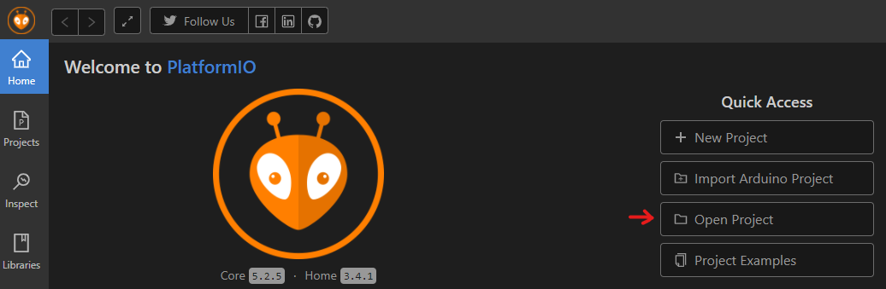
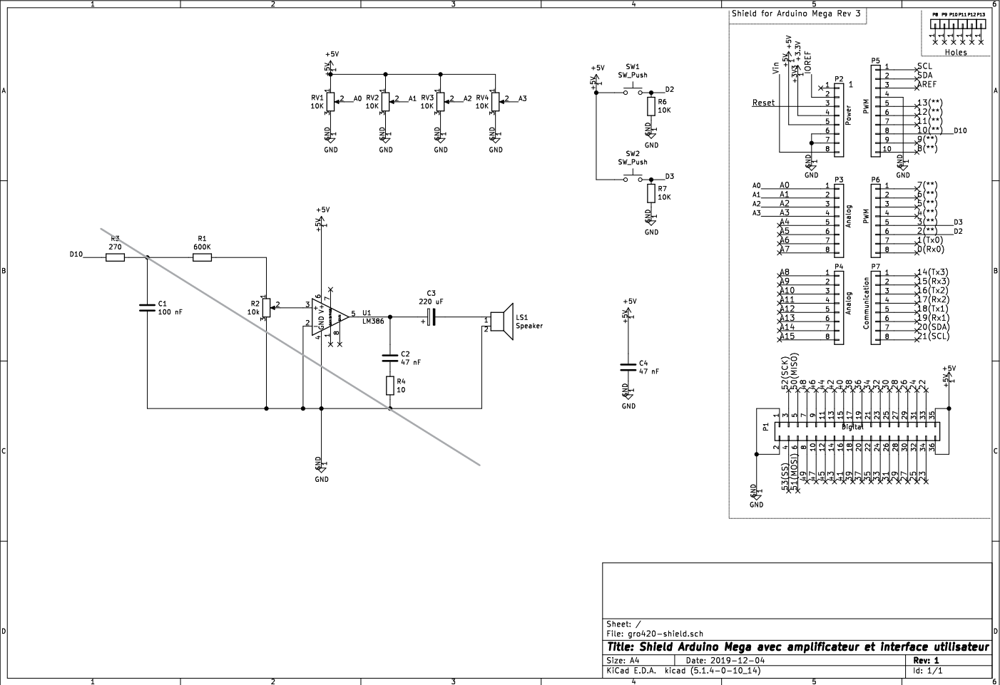
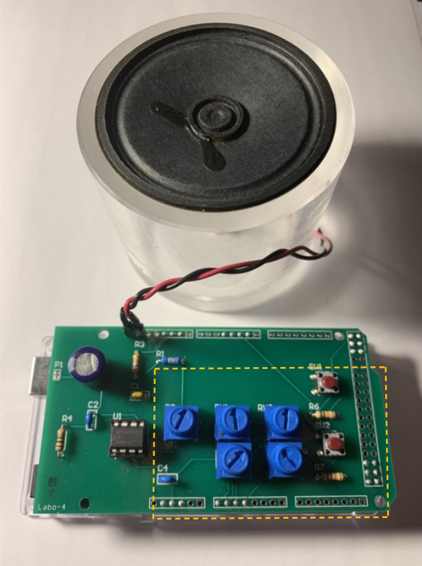

# Sym-Bot : User Interface Glove

    

## Table of Content
- [Sym-Bot : User Interface Glove](#sym-bot--user-interface-glove)
  - [Table of Content](#table-of-content)
  - [Material](#material)
    - [Electrical Components](#electrical-components)
    - [Other components](#other-components)
  - [Electrical Schematic](#electrical-schematic)
  - [Getting started](#getting-started)
    - [Environnement setup](#environnement-setup)
    - [Running the code](#running-the-code)
    - [Recommendations](#recommendations)
  - [How to use the Sym-Bot Glove with the Robotic Arm](#how-to-use-the-sym-bot-glove-with-the-robotic-arm)
  - [Alternative](#alternative)

## Material
### Electrical Components
- #### ESP32 microcontroller
  * Brand : [Espressif inc.](https://www.espressif.com/en/products/devkits/esp32-devkitc/overview)
  * Model : DOIT ESP32 DEVKIT v1
  * Quantity : 1 

- #### Flex Sensor
    * Brand : [SparkFun](https://www.sparkfun.com/products/14666)
    * Mdoel : SparkFun Qwiic Flex Glove Controller
    * Quantity : 2
    * **Note: You can also use individual flex sensors, that will change the code implementation, because the data communication will not be I2C.** 

- #### IMU
  * Brand : [Grove-SeeedStudio](https://wiki.seeedstudio.com/Grove-IMU_9DOF_v2.0/)
  * Model : IMU 9DOF v2.0
  * Quantity : 1

- #### Power Supply
  * Brand : [EnergyCell Mini](https://www.amazon.ca/-/fr/EnergyCell-chargeur-portable-5000-compatible/dp/B09JNSVJD4/ref=sr_1_18?__mk_fr_CA=%C3%85M%C3%85%C5%BD%C3%95%C3%91&crid=2YP1LRY4BZLER&keywords=power%2Bbank%2B5v&qid=1649544794&refinements=p_36%3A12035760011&rnid=12035759011&s=electronics&sprefix=power%2Bbank%2B5v%2Caps%2C86&sr=1-18&th=1)
  * Model : Black
  * Quantity : 1
  * **Note: You can use your own power bank of 5V with at least 1250mAh, depends on your glove's time usage with one charge.**
  
- #### RGB LED module
  * For example: [LED RGB module](https://fr.banggood.com/3-Colour-RGB-SMD-LED-Display-Module-5050-Full-Color-p-90626.html?cur_warehouse=USA&rmmds=search)
- #### Button
- #### Some Wires
- #### Breadboard (for testing)

### Other components
- #### Gardening Gloves
- #### Medical Gloves (each finger of the gardening glove should fit inside the medical glove)

## Electrical Schematic

    

*Refer also to the [picture](#sym-bot--user-interface-glove) above for assembly*

## Getting started
### Environnement setup
First, you'll neeed to install [Visual Studio Code](https://code.visualstudio.com/Download)

When you open Visual Studio Code, go to the Extensions section  search for the extension [PlatformIO](https://marketplace.visualstudio.com/items?itemName=platformio.platformio-ide) and finally, install it.

### Running the code
Once everything is installed, you can click on the little Home button  that is on the bottom blue bar, near the left side. 

Then go to Open Project

  

Search and choose to open the Glove folder

That's it! Now you are ready to Build and Compile  the code on the DOIT-ESP32 Devkit v1

### Recommendations 

If you're running into some troubles with the DOIT-ESP32 Devkit v1 [check this site](https://randomnerdtutorials.com/esp32-troubleshooting-guide/). **I personally had to follow the 6th troubleshooting(COM port not found) for using for the first time the DOIT-ESP32 Devkit v1.**

More information on setting up [DOIT-ESP32 Devkit v1](https://docs.platformio.org/en/latest/boards/espressif32/esp32doit-devkit-v1.html) with PlatformIO.

You can also change the type of board and some other settings in the file [platformio.ini](https://docs.platformio.org/en/latest/projectconf/index.html). 

## How to use the Sym-Bot Glove with the Robotic Arm

To control the robotic arm with the glove, there are three modes available:

- The first one is Jog Mode with the orange LED, in this mode you control individually each motor of the robotic arm by closing either the index, middle or/and ring finger(s) and the orientation of the rotation of the motor with the orientation of the hand. The pinky closes or opens the gripper.
- The second mode is Cartesian Mode with the green LED, in this mode you can control with precision the gripper and normally you can move horizontally the gripper with the index and vertically with the middle finger. With the ring finger you can control the base rotation. This mode doesn't work well right now, it is in early development.
- Finally, we have the Gesture Mode (AI) with the blue LED, in this mode you control the robotic arm with gestures. We only added three gestures for now:
  - The first one is with only the index open and the others fingers closed and the palm of the hand facing the ground (like pointing something)
  - The second one is the same as the first one, but the palm is facing up.
  - The last is just all the fingers closed.
  
  So, the first gesture makes the robot do a pick animation, the second is a drop animation and the last is go to Home position. This mode is also in early development.

## Alternative
The symbotUIproto code provided can be used with the Arduino Mega 2560 ATmega. This code uses USB Serial communication with the main.py in Application folder. You can use it with the JOG and JOINT mode that are in translate.py to control the robotic arm. 

To help you recreate the proto-board shield that goes on the Arduino Mega, here's an electrical schematic with a picture.

  
  
Electrical schematic of the proto-board

    
    
PCB shield used to mock the glove

***Images from the Proto-Board are provided by University of Sherbrooke from the Robotics Engineering program and with the autorisation of François Ferland***
