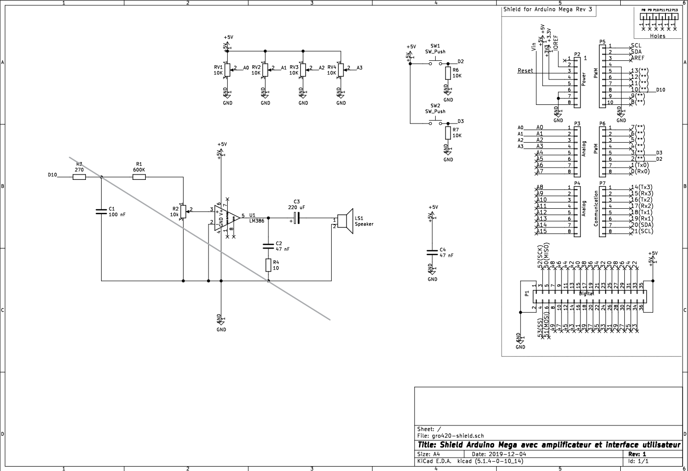
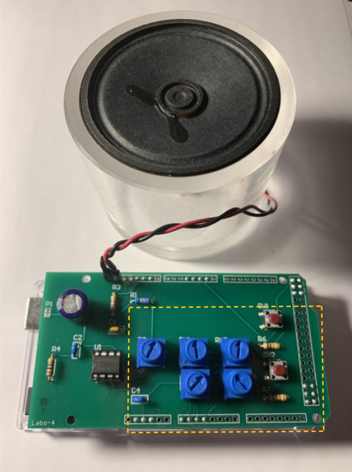

# Sym-Bot : User Interface Glove

    

## Table of Content
- [Sym-Bot : User Interface Glove](#sym-bot--user-interface-glove)
  - [Table of Content](#table-of-content)
  - [Material](#material)
    - [Electrical Components](#electrical-components)
    - [Other components](#other-components)
  - [Electrical Schematic](#electrical-schematic)
  - [Getting started](#getting-started)
    - [Environnement setup](#environnement-setup)
    - [Running the code](#running-the-code)
    - [Notes](#notes)
  - [How to use the Sym-Bot Glove](#how-to-use-the-sym-bot-glove)
  - [Alternative](#alternative)

## Material
### Electrical Components
- #### ESP32 microcontroller
  * Brand : [Espressif inc.](https://www.espressif.com/en/products/devkits/esp32-devkitc/overview)
  * Model : DOIT ESP32 DEVKIT v1
  * Quantity : 1 

- #### Flex Sensor
    * Brand : [SparkFun](https://www.sparkfun.com/products/14666)
    * Mdoel : SparkFun Qwiic Flex Glove Controller
    * Quantity : 2
    * **Note: You can also use individual flex sensors, that will change the code implementation, because the data communication will not be I2C.** 

- #### IMU
  * Brand : [Grove-SeeedStudio](https://wiki.seeedstudio.com/Grove-IMU_9DOF_v2.0/)
  * Model : IMU 9DOF v2.0
  * Quantity : 1

- #### Power Supply
  * Brand : [EnergyCell Mini](https://www.amazon.ca/-/fr/EnergyCell-chargeur-portable-5000-compatible/dp/B09JNSVJD4/ref=sr_1_18?__mk_fr_CA=%C3%85M%C3%85%C5%BD%C3%95%C3%91&crid=2YP1LRY4BZLER&keywords=power%2Bbank%2B5v&qid=1649544794&refinements=p_36%3A12035760011&rnid=12035759011&s=electronics&sprefix=power%2Bbank%2B5v%2Caps%2C86&sr=1-18&th=1)
  * Model : Black
  * Quantity : 1
  * **Note: You can use your own power bank of 5V with at least 1250mAh, depends on your glove's time usage with one charge.**
  
- #### RGB LED module
  * For example: [LED RGB module](https://fr.banggood.com/3-Colour-RGB-SMD-LED-Display-Module-5050-Full-Color-p-90626.html?cur_warehouse=USA&rmmds=search)
- #### Button
- #### Some Wires
- #### Breadboard (for testing)

### Other components
- #### Gardening Gloves
- #### Medical Gloves (each finger of the gardening glove should fit inside the medical glove)

## Electrical Schematic

    

*Refer also to the [picture](#sym-bot--user-interface-glove) above for assembly*

## Getting started
### Environnement setup
First, you'll neeed to install [Visual Studio Code](https://code.visualstudio.com/Download)

When you open Visual Studio Code, go to the Extensions section search for the extension [PlatformIO](https://marketplace.visualstudio.com/items?itemName=platformio.platformio-ide) and finally, install it.

### Running the code
Once everything is installed, you can click on the little Home button.

Then go to Open Project

Choose Glove folder

That's it! Now you are ready to Build and Compile the code to an DOIT-ESP32 Devkit v2

### Notes

You can change the type of board and some other settings in the file [platformio.ini](https://docs.platformio.org/en/latest/projectconf/index.html).

## How to use the Sym-Bot Glove
Coming soon

## Alternative
Le code symbotUIproto vous permet de simuler partiellement le gant en mode JOG et JOINT en envoyant les données sur port USB à l'aide d'un Arduino Mega.

Pour le circuit électrique, vous pouvez vous inspirer du montage Proto Board ci-dessus.

    
    
PCB utilisé pour simuler le gant

***Les images proviennent d'un montage utilisé, Proto Board, dans un cours à l'Université de Sherbrooke en Génie Robotique avec l'autorisation de Monsieur François Ferland)***
