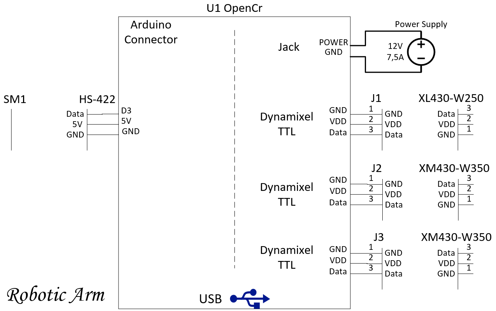

# Material and Assembly

## Table of Content
- [Material and Assembly](#material-and-assembly)
  - [Table of Content](#table-of-content)
  - [Electrical Components](#electrical-components)
    - [MicroController](#microcontroller)
    - [Dynamixel Motors 1](#dynamixel-motors-1)
    - [Dynamixel Motors 2](#dynamixel-motors-2)
    - [ServoMotors](#servomotors)
    - [Power Supply](#power-supply)
  - [Assembly Info](#assembly-info)
    - [couplerW350](#couplerw350)
    - [Gripper](#gripper)
  - [Electrical Schematic](#electrical-schematic)

## Electrical Components
### MicroController
* Brand : [OpenCr](https://www.robot-advance.com/art-opencr1-0-robotis-2353.htm)
* Model : OpenCr
* Quantity : 1

### Dynamixel Motors 1
* Brand : [Dynamixel](https://emanual.robotis.com/docs/en/software/dynamixel/dynamixel_workbench/)
* Model : XM430-W350
* Quantity : 1

### Dynamixel Motors 2
* Brand : [Dynamixel](https://emanual.robotis.com/docs/en/software/dynamixel/dynamixel_workbench/)
* Model : XM430-W250
* Quantity : 2

### ServoMotors
* Brand : [HiTec](https://www.robotshop.com/ca/en/hitec-hs-422-servo-motor.html?gclid=CjwKCAjwlcaRBhBYEiwAK341jfIg3fw_xTxtCtNNNh4yNMYIuuqdtHVJHqRt-310Qe8wRKAHFg4d1xoCRGkQAvD_BwE)
* Model : HS-422
* Quantity : 1

### Power Supply
* Brand : [GlobTek inc.](https://www.digikey.ca/en/products/detail/globtek-inc/TR9CE7500LLP-IM-R6B/11201299?s=N4IgTCBcDaIOIBUCyBOAbCgDJgClgjBALoC%2BQA)
* Model : GTM96900P9012-T2
* Quantity : 1

## Assembly Info
Assembly schematics and BOMs for each part of the robot (gripper, arm and base) are available in "Material and Assembly" -> "Assembly". Parts that need to be printed can be found in their respective "STL" folder.

### couplerW350
The XM430-W350 Dynamixel motors use a particular coupler in order to support higher torques. The couplerW350 (available under "Miscellaneous") functions as a bridge between the motor and the 545548 hub. To properly assemble the coupler, the following screws should be used:
* 4 x M2x03 socket head
* 4 x 6-32x1/4 socket head

### Gripper
Due to its compactness, the gripper should be assembled in a specific order to tighten every screws properly.
* Assemble the claw tips and the racks through the slots of the casing using the appropriate spacers and washers in between.
* Fix the HS-422 Hitec servomotor to the casing. In order to protect the casing, the use of washers is recommended, but not necessary.
* Install the adaptor. Make sure the cables of the Hitec servomotor bend in a natural way to avoid permanent damage.
* Screw the two parts of the casing together. Make sure the driving gear is in its "open" state by turning it clockwise until it blocks before connecting it with the racks.
* Gently push the claw tips toward each other. If everything went well, the gear should rotate along. The gripper is now ready to use.

## Electrical Schematic

