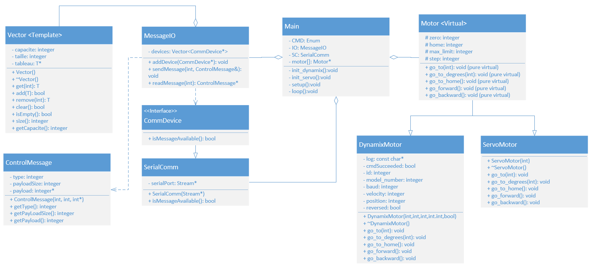

# Sym-Bot : Motor Control

## Table of Content
- [Sym-Bot : Motor Control](#sym-bot--motor-control)
  - [Table of Content](#table-of-content)
  - [Environment](#environment)
  - [Calibration](#calibration)
  - [Control](#control)

## Environment
- Software : [Arduino IDE](https://www.arduino.cc/en/software) (1.8.19)
- Add OpenCr board (1.6.4) with instructions : https://emanual.robotis.com/docs/en/parts/controller/opencr10/#arduino-ide
- Add library ArduinoJson (6.18.5) with Libray Manager
- Optional : Using [Visual Studio Code](https://code.visualstudio.com/) like a source-sode editor and add extension Arduino, publisher Microsoft
- WARNING : The codes below uses the versions mentioned in above (#.#.#).

## Calibration
With monitor_m, we can get the different motor's position
1. Open Serial Monitor after uploading the code
2. Write "begin [baudrate]" to initialise the communication with motor(s)
3. Write "scan [range]" to find the motor's id
4. Write "joint (id)" to set joint mode | Foreach motor
5. Write "torque (id) 0" to disable torque | Foreach motor
6. Position the robot at its zero
7. Write "position (id)" to get present position from motor | Foreach motor
8. Transcribe the results into main code, function init_dynamix()
9. Repeat step [6,8] for different position
10. If motor doesn't rotate in good direction, you can write "counter_clockwise (id)" or "clockwise (id)"

* Write what is in the quotation marks to Serial Monitor, [] => optional number and () => must number

## Control
With main, we can upload the code to control the robotic arm.

Before uploading the OpenCR Microcontroller code , make sur that the values defined in the init_dynamix() and init_servo() functions coresponds to your articulated arm implementation

After uploading the code on the OpenCr Board, you can test the communication by writing directly to the monitor serial (Arduino IDE) 
Summary for JSON message :
- "type": Define the command, [1,9] : Action cmd, [11,19] : Set command & [21,29] : Return command
- "PLS" : Length of data
- "data": Data for motors [J1,J2,J3,Gripper] (Ignore when it's return command, store the informations)
Example :
- {"type":1,"PLS":4,"data":[180,45,90,180]} => HOME Position in JOINT MODE
- {"type":2,"PLS":4,"data":[180,45,90,180]} => Set Robotic Arm in HOME Position
- {"type":3,"PLS":4,"data":[0,1,-1,1]}      => [Not move, Foward, Backward, Close] in JOG MODE, Only once
- Repeat {"type":3,"PLS":4,"data":[0,1,-1,1]} to keep jog
- {"type":27,"PLS":4,"data":[0,0,0,0]}      => Return the actual position the each motor in data (step unit)

  <h4>Class Diagram Main</h4>
  

